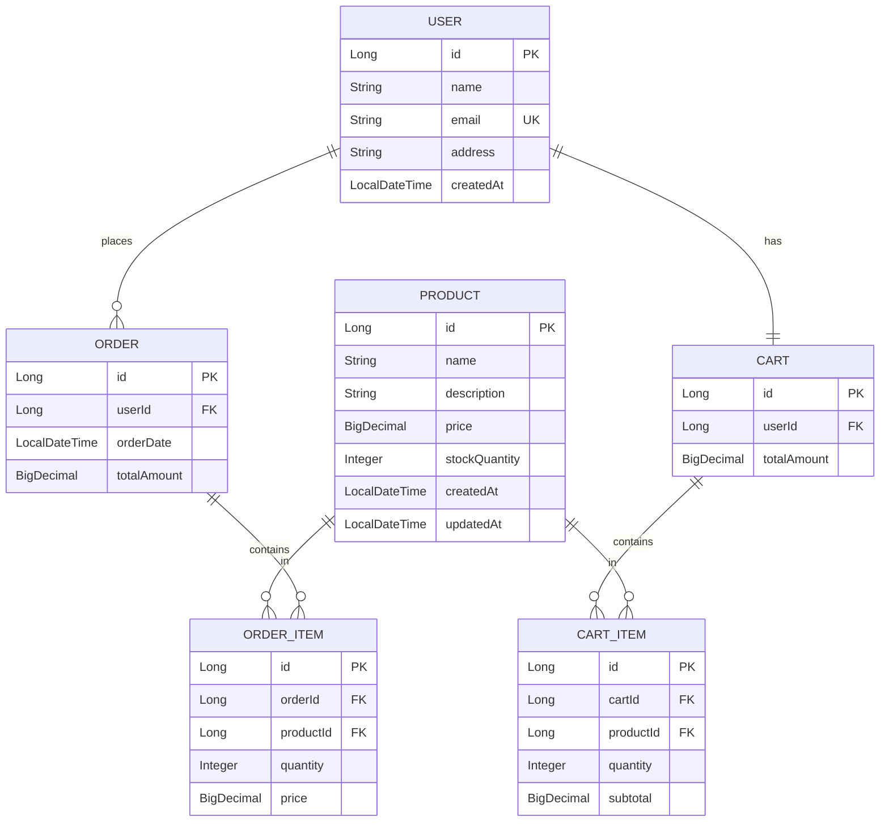

<div align="center">

# 🛍️ E-Commerce Backend 

### *A Modern, Scalable Spring Boot E-Commerce Platform*

[](https://spring.io/projects/spring-boot)
[](https://www.oracle.com/java/)
[](https://www.mysql.com/)
[](LICENSE)
[](https://github.com/arijitnandi07/ecommerce-backend)

[Features](#-features) • [Tech Stack](#️-tech-stack) • [Getting Started](#-getting-started) • [API Documentation](#-api-documentation) • [Architecture](#️-architecture)

---


*Enterprise-grade REST API for modern e-commerce applications*

</div>

---

## 📋 Table of Contents

- [✨ Features](#-features)
- [🏗️ Tech Stack](#️-tech-stack)
- [🚀 Getting Started](#-getting-started)
- [📁 Project Structure](#-project-structure)
- [🔗 API Documentation](#-api-documentation)
- [🗄️ Database Schema](#️-database-schema)
- [🧪 Testing](#-testing)
- [🎯 Roadmap](#-roadmap)
- [🤝 Contributing](#-contributing)
- [📄 License](#-license)

---

## ✨ Features

<table>
<tr>
<td width="50%">

### 👥 **User Management**
- ✅ User registration with validation
- ✅ Profile management
- ✅ Email-based user lookup
- ✅ Secure data handling

### 🛒 **Shopping Cart**
- ✅ Real-time cart updates
- ✅ Automatic total calculation
- ✅ Stock validation
- ✅ Quantity management

</td>
<td width="50%">

### 📦 **Product Catalog**
- ✅ Full CRUD operations
- ✅ Advanced search & filtering
- ✅ Price range queries
- ✅ Stock management

### 📊 **Order Processing**
- ✅ Seamless checkout
- ✅ Order history tracking
- ✅ Stock synchronization
- ✅ Order cancellation

</td>
</tr>
</table>

### 🎯 **Additional Features**

```diff
+ Centralized Exception Handling
+ Input Validation with Bean Validation
+ RESTful API Design
+ Transaction Management
+ Lazy Loading Optimization
+ Consistent API Response Format
+ Comprehensive Error Messages
```

---

## 🏗️ Tech Stack

<div align="center">

| Category | Technologies |
|----------|-------------|
| **Backend** |   |
| **Database** |   |
| **Build Tool** |  |
| **Testing** |   |

</div>

### 📦 Core Dependencies

```xml
• Spring Boot Starter Web
• Spring Boot Starter Data JPA
• Spring Boot Starter Validation
• MySQL Connector
• Spring Boot DevTools
• Spring Boot Starter Test
```

---

## 🚀 Getting Started

### Prerequisites

Before you begin, ensure you have the following installed:

- ☕ **Java 17** or higher
- 🗄️ **MySQL 8.0** or higher
- 📦 **Maven 3.6** or higher
- 🔧 **Git**

### 📥 Installation

#### 1️⃣ Clone the Repository

```bash
git clone https://github.com/arijitnandi07/ecommerce-backend.git
cd ecommerce-backend
```

#### 2️⃣ Configure Database

Create MySQL database:

```sql
CREATE DATABASE ecommerce_db;
```

Update `src/main/resources/application.yml`:

```yaml
spring:
  datasource:
    url: jdbc:mysql://localhost:3306/ecommerce_db?useSSL=false&serverTimezone=UTC
    username: your_username
    password: your_password
  
  jpa:
    hibernate:
      ddl-auto: update
    show-sql: true
```

#### 3️⃣ Build the Project

```bash
mvn clean install
```

#### 4️⃣ Run the Application

```bash
mvn spring-boot:run
```

Or run directly from your IDE.

### ✅ Verify Installation

Application starts on: **http://localhost:8080**

Test with:
```bash
curl http://localhost:8080/api/v1/products
```

Expected response:
```json
{
  "success": true,
  "message": "Products retrieved successfully",
  "data": []
}
```

---

## 📁 Project Structure

```
ecommerce-backend/
│
├── 📂 src/main/java/com/ecommerce/
│   ├── 🎮 controller/          # REST API Controllers
│   │   ├── UserController.java
│   │   ├── ProductController.java
│   │   ├── CartController.java
│   │   └── OrderController.java
│   │
│   ├── 📋 dto/                  # Data Transfer Objects
│   │   ├── ApiResponse.java
│   │   ├── UserDto.java
│   │   ├── ProductDto.java
│   │   ├── AddToCartRequest.java
│   │   └── CartItemDto.java
│   │
│   ├── 🗃️ entity/               # JPA Entities
│   │   ├── User.java
│   │   ├── Product.java
│   │   ├── Cart.java
│   │   ├── CartItem.java
│   │   ├── Order.java
│   │   └── OrderItem.java
│   │
│   ├── ⚠️ exception/            # Exception Handling
│   │   ├── GlobalExceptionHandler.java
│   │   ├── ResourceNotFoundException.java
│   │   └── InsufficientStockException.java
│   │
│   ├── 💾 repository/           # Data Access Layer
│   │   ├── UserRepository.java
│   │   ├── ProductRepository.java
│   │   ├── CartRepository.java
│   │   └── OrderRepository.java
│   │
│   ├── 🔧 service/              # Business Logic
│   │   ├── UserService.java
│   │   ├── ProductService.java
│   │   ├── CartService.java
│   │   └── OrderService.java
│   │
│   └── 🚀 ECommerceApplication.java  # Main Application
│
├── 📂 src/main/resources/
│   ├── application.yml          # Configuration
│   └── data.sql                 # Sample Data (Optional)
│
├── 📂 src/test/java/            # Test Cases
│
├── 📄 pom.xml                   # Maven Dependencies
└── 📖 README.md                 # This File
```

---

## 🔗 API Documentation

### Base URL
```
http://localhost:8080/api/v1
```

### 👥 User Management

<details>
<summary><b>Register User</b></summary>

```http
POST /api/v1/users/register
Content-Type: application/json

{
  "name": "John Doe",
  "email": "john.doe@example.com",
  "address": "123 Main Street, New York, NY"
}
```

**Response:**
```json
{
  "success": true,
  "message": "User registered successfully",
  "data": {
    "id": 1,
    "name": "John Doe",
    "email": "john.doe@example.com",
    "address": "123 Main Street, New York, NY",
    "createdAt": "2024-01-15T10:30:00"
  }
}
```
</details>

<details>
<summary><b>Get User by ID</b></summary>

```http
GET /api/v1/users/{id}
```
</details>

<details>
<summary><b>Get User by Email</b></summary>

```http
GET /api/v1/users/email/{email}
```
</details>

<details>
<summary><b>Update User</b></summary>

```http
PUT /api/v1/users/{id}
Content-Type: application/json

{
  "name": "John Smith",
  "email": "john.smith@example.com",
  "address": "456 Oak Avenue, Boston, MA"
}
```
</details>

<details>
<summary><b>Delete User</b></summary>

```http
DELETE /api/v1/users/{id}
```
</details>

### 🛍️ Product Management

<details>
<summary><b>Create Product</b></summary>

```http
POST /api/v1/products
Content-Type: application/json

{
  "name": "MacBook Pro 16-inch",
  "description": "Apple MacBook Pro with M2 chip",
  "price": 2499.99,
  "stockQuantity": 10
}
```
</details>

<details>
<summary><b>Get All Products</b></summary>

```http
GET /api/v1/products
```
</details>

<details>
<summary><b>Search Products</b></summary>

```http
GET /api/v1/products/search?name=MacBook
```
</details>

<details>
<summary><b>Filter by Price Range</b></summary>

```http
GET /api/v1/products/price-range?minPrice=100&maxPrice=1000
```
</details>

### 🛒 Cart Management

<details>
<summary><b>Add to Cart</b></summary>

```http
POST /api/v1/cart/add/{userId}
Content-Type: application/json

{
  "productId": 1,
  "quantity": 2
}
```
</details>

<details>
<summary><b>Get Cart Items</b></summary>

```http
GET /api/v1/cart/items/{userId}
```
</details>

<details>
<summary><b>Update Cart Item</b></summary>

```http
PUT /api/v1/cart/item/{cartItemId}?quantity=3
```
</details>

<details>
<summary><b>Clear Cart</b></summary>

```http
DELETE /api/v1/cart/clear/{userId}
```
</details>

### 📦 Order Management

<details>
<summary><b>Place Order</b></summary>

```http
POST /api/v1/orders/place/{userId}
```
</details>

<details>
<summary><b>Get User Orders</b></summary>

```http
GET /api/v1/orders/user/{userId}
```
</details>

<details>
<summary><b>Get Order Details</b></summary>

```http
GET /api/v1/orders/{orderId}/items
```
</details>

<details>
<summary><b>Cancel Order</b></summary>

```http
DELETE /api/v1/orders/{orderId}
```
</details>

### 📋 Complete API Endpoints

| Method | Endpoint | Description |
|--------|----------|-------------|
| **Users** |
| `POST` | `/api/v1/users/register` | Register new user |
| `GET` | `/api/v1/users/{id}` | Get user by ID |
| `GET` | `/api/v1/users/email/{email}` | Get user by email |
| `GET` | `/api/v1/users` | Get all users |
| `PUT` | `/api/v1/users/{id}` | Update user |
| `DELETE` | `/api/v1/users/{id}` | Delete user |
| **Products** |
| `POST` | `/api/v1/products` | Create product |
| `GET` | `/api/v1/products` | Get all products |
| `GET` | `/api/v1/products/{id}` | Get product by ID |
| `GET` | `/api/v1/products/available` | Get available products |
| `GET` | `/api/v1/products/search?name=` | Search products |
| `GET` | `/api/v1/products/price-range` | Filter by price |
| `PUT` | `/api/v1/products/{id}` | Update product |
| `DELETE` | `/api/v1/products/{id}` | Delete product |
| **Cart** |
| `POST` | `/api/v1/cart/add/{userId}` | Add to cart |
| `GET` | `/api/v1/cart/{userId}` | Get cart |
| `GET` | `/api/v1/cart/items/{userId}` | Get cart items |
| `PUT` | `/api/v1/cart/item/{cartItemId}` | Update quantity |
| `DELETE` | `/api/v1/cart/item/{cartItemId}` | Remove item |
| `DELETE` | `/api/v1/cart/clear/{userId}` | Clear cart |
| **Orders** |
| `POST` | `/api/v1/orders/place/{userId}` | Place order |
| `GET` | `/api/v1/orders/{orderId}` | Get order |
| `GET` | `/api/v1/orders/user/{userId}` | Get user orders |
| `GET` | `/api/v1/orders/{orderId}/items` | Get order items |
| `GET` | `/api/v1/orders` | Get all orders |
| `DELETE` | `/api/v1/orders/{orderId}` | Cancel order |

---

## 🗄️ Database Schema

<div align="center">



</div>

### 📊 Entity Relationships

```
┌─────────┐          ┌──────────┐          ┌─────────────┐
│  USER   │ 1 ──── 1 │   CART   │ 1 ──── ∞ │  CART_ITEM  │
└─────────┘          └──────────┘          └─────────────┘
     │ 1                                           │ ∞
     │                                             │
     │ ∞                                    ┌──────────┐
     │                                      │ PRODUCT  │
┌─────────┐          ┌─────────────┐       └──────────┘
│  ORDER  │ 1 ──── ∞ │ ORDER_ITEM  │ ∞ ────────┘
└─────────┘          └─────────────┘
```

---

## 🧪 Testing

### Run Unit Tests

```bash
mvn test
```

### Run Integration Tests

```bash
mvn verify
```

### Test Coverage

```bash
mvn clean test jacoco:report
```

### Manual Testing with Postman

1. **Import Collection**: Use the provided Postman collection
2. **Set Environment**: Configure base URL and variables
3. **Run Tests**: Execute all endpoints sequentially

### Sample Test Scenario

```bash
# 1. Register User
curl -X POST http://localhost:8080/api/v1/users/register \
  -H "Content-Type: application/json" \
  -d '{"name":"Test User","email":"test@example.com","address":"Test Address"}'

# 2. Create Product
curl -X POST http://localhost:8080/api/v1/products \
  -H "Content-Type: application/json" \
  -d '{"name":"Laptop","description":"Gaming Laptop","price":1500,"stockQuantity":10}'

# 3. Add to Cart
curl -X POST http://localhost:8080/api/v1/cart/add/1 \
  -H "Content-Type: application/json" \
  -d '{"productId":1,"quantity":2}'

# 4. Place Order
curl -X POST http://localhost:8080/api/v1/orders/place/1
```

---

## 🎯 Roadmap

### 🚧 Current Development

- [ ] JWT Authentication & Authorization
- [ ] Role-based Access Control (RBAC)
- [ ] Payment Gateway Integration
- [ ] Email Notifications
- [ ] Product Reviews & Ratings

### 🔮 Future Enhancements

- [ ] Wishlist Feature
- [ ] Discount & Coupon System
- [ ] Multi-vendor Support
- [ ] Analytics Dashboard
- [ ] GraphQL API
- [ ] Microservices Architecture
- [ ] Docker Containerization
- [ ] CI/CD Pipeline
- [ ] API Rate Limiting
- [ ] Caching with Redis

---

## 🤝 Contributing

Contributions are welcome! Please follow these steps:

1. **Fork** the repository
2. **Create** your feature branch (`git checkout -b feature/AmazingFeature`)
3. **Commit** your changes (`git commit -m 'Add some AmazingFeature'`)
4. **Push** to the branch (`git push origin feature/AmazingFeature`)
5. **Open** a Pull Request

### 📝 Contribution Guidelines

- Follow Java coding conventions
- Write meaningful commit messages
- Add unit tests for new features
- Update documentation
- Ensure all tests pass

---

## 📄 License

This project is licensed under the **MIT License** - see the [LICENSE](LICENSE) file for details.

---

## 👨‍💻 Author

<div align="center">

**Arijit Nandi**

[](https://github.com/)
[](https://linkedin.com/in/)
[](mailto:nand)

</div>

---

---

<div align="center">


**Made with ❤️ by Arijit **

[Back to Top](#️-e-commerce-backend-api)

</div>
